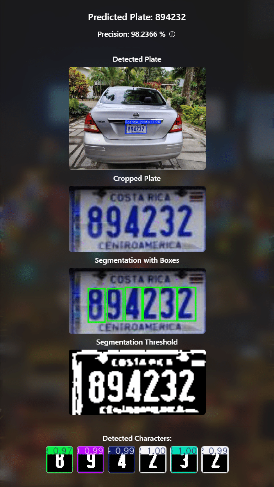
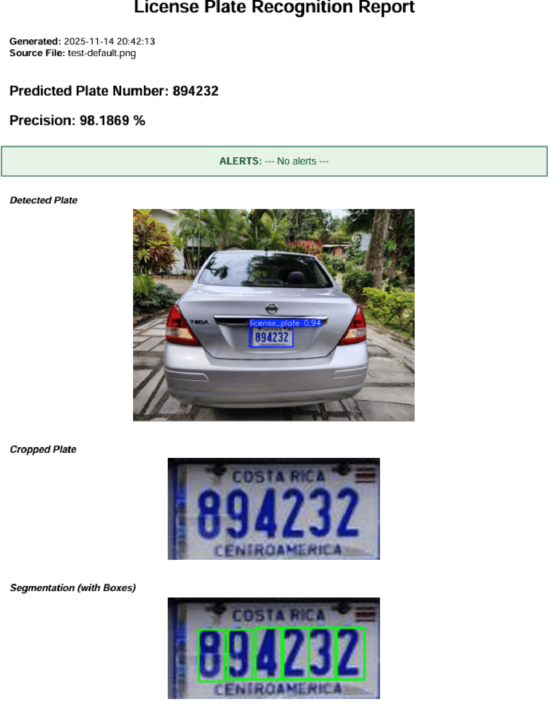

# License Plate Recognition with YOLO

This project implements a **car license plate detection system** using [Ultralytics YOLO](https://github.com/ultralytics/ultralytics) for object detection and character recognition. 

It includes utilities to automatically prepare the plate recognition dataset from KaggleHub, train the model, validate it, run predictions and crop the detected license plate from the input image.

<br>

## Content

- [Key Features](#key-features)
- [Project Structure](#project-structure)
- [Requirements](#requirements)
- [How to use it](#how-to-use-it)

  - [Using the UI](#using-the-ui)
    - [Set up the app locally](#set-up-the-app-locally)
    - [Use the app](#use-the-app)

  - [Using the Makefile](#using-the-makefile)
    - [Dataset preparation](#dataset-preparation)
    - [Model training](#model-training)
    - [Model validation](#model-validation)
    - [Model export](#model-export)
    - [Prediction](#prediction)
    - [Test the system](#test-the-system)

<br>

## Key Features

### Core Functionality
- Detect license plates using a YOLOv11 model.
- Preprocess and filter the plate region.
- Segment characters using contour detection.
- Infer characters using a custom trained YOLOv11 model.
- Reconstruct the final plate string automatically.
- Compute precision metrics across plate and characters.


### Web Interface

- Upload images or use a built-in default test image.

- Allows the user to visualize:
  - Plate detected
  - Cropped plate
  - Segmentation boxes
  - Segmentation threshold plate
  - Individual character crops
  - Plate inference result

- Export results as a PDF report.


### Additional Utilities

- Automatic dataset creation for character inference.
- Folder cleanup utilities.
- Modularized utility functions.
- Makefile for training, testing, inference, and dataset setup.

<br>

## Project Structure

The following diagram describes how the coded is organized within the `src` folder:

```bash
src/
├── app.py                        # Flask application
├── assets/                       # App assets
├── models/                       # YOLO models for plates and characters
│   └── yoloPlateDetection
│   └── yoloCharInference
├── utils/                        # Core utilities
│   ├── plateDetectionUtils.py
│   ├── charInferenceUtils.py
│   ├── segmentationUtils.py
│   ├── preprocessingUtils.py
│   ├── datasetUtils.py
│   └── userInterfaceUtils.py
├── outputs/                      # All generated results from an inference
│   ├── plateCrop/
│   ├── segmentationResults/
│   ├── charCrops/
│   ├── charInference/
│   ├── plateDetection/
│   └── last_result.json
├── uploads/                      # Uploaded image
├── tests/                        # Tests for each util file
├── UI/                           # Graphical user interface
│   ├── templates/
│   └── static/
├── Makefile                      # Targets for individual testing
├── requirements.txt              # App requirements
└── README.md
```

<br>

## Requirements

Use the `requirements.txt` file provided to install all the necessary dependencies by running:

```bash
pip install -r requirements.txt
```

<br>


# How to use it 

There are 2 options to use the app: 

- By using the UI 
- By using the Makefile provided. 

It is recommended to use the UI for user interaction and the Makefile for command-like usage. 

The following sections describe how to setup the YOLO models and datasets for license plates detection and character recognition, train them, validate the results, export the models and generate some predictions.

## Using the UI

### Set up the app locally

If you prefer to use the UI, then you will have to setup the app locally. To do so, follow these steps:

- **Clone the project repository:**

  ```bash
  git clone https://github.com/04esteban04/licensePlateRecognition.git
  ```  

<br>

- **Install the required dependencies:**

  ```bash
  pip install -r requirements.txt
  ```

<br>

- **Setting up the database:**

  - Ensure you have `PostgreSQL` installed and running.

  - Create a new database using the SQL script located at `src/assets/dbCreation/setupDB.sql`

  - Create a `.env` file inside the `src` directory and provide your database credentials:

    ```bash
    PGHOST=localhost
    PGPORT=db_localPort
    PGDATABASE=db_name
    PGUSER=db_user
    PGPASSWORD=db_password
    ```

  - The database will automatically initialize when the application runs.

<br>

- **Running the application:**

  - Open a terminal, navigate to the `src` folder and run:

    ```bash
    python app.py
    ```
  
  <br>

  - Open your browser and go to:

    ```bash
    http://localhost:5000
    ```

  <br>

> [!NOTE]
> This command launches the backend, frontend, inference logic, and PDF reporting system.


<br>
<hr>
<br>

### Use the app
Now that you have everything setup, these are the steps to use the app:

- **Navigate to the analysis page**
  
  <p align="center">
    
  </p>

<br>

- **Select the desired mode (individual or default)**

  

<br>

- **Upload your image or use the default one provided**

- **View the recognition results in card/table format**

  

  

<br>

- **Download a PDF report if desired**

  

<br>


## Using the Makefile

The following sections describe how to use the app with the Makefile provided

### Dataset preparation

The dataset for license plate recognition is automatically downloaded from _Kaggle_ when running any script that calls the function `prepareDataset`. It could also be done by just running the command:

```bash
make setupPlateDetectionDataset
```

<br>

> [!NOTE]  
> It will be stored at: `dataset/License-Plate-Data/`

<br>

Then, to setup the dataset for character recognition simply run:

```bash
make setupCharInferenceDataset
```

<br>

### Model training

Train the YOLO model for object detection on the _Kaggle_ dataset by running:

```bash
make trainPlateDetectionModel
```

> [!NOTE]  
> This will:
> - Download the dataset if not already available.
> - Update the `data.yaml` file with absolute paths.
> - Train the model and save the weights in `models/yolo/train/weights/best.pt`.

<br>


Similarly, run the following command to train the YOLO model for character recognition

```bash
make trainCharInferenceModel
```

<br>

### Model validation

It could be done by running one of the following commands depending on which model you choose:

```bash
make evaluatePlateDetectionModel
make evaluateCharInferenceModel
```

> [!NOTE]  
> Results will be stored in `models/yoloPlateDetection/validation/` and `models/yoloCharInference/validation/` respectively.

<br>

### Model export

Export the trained model to ONNX format by running:

```bash
make exportPlateDetectionModel
make exportCharInferenceModel

```

> [!NOTE]  
> It wil be stored at `models/yoloPlateDetection/train/weights/best.onnx` and `models/yoloCharInference/train/weights/best.onnx` respectively.

<br>

### Prediction

Run predictions on test images by running:

```bash
make predict
```

> [!NOTE]  
> This will generate:
> - Images with detections in outputs/predict/.
> - Cropped license plates in outputs/crops/.

<br>

### Test the system

To do a prediction on a test image in just one command simply run:

```bash
make main
```

> [!NOTE]  
> The results will be saved under:
> - `outputs/charCrops/<filename>` (for every result with the plate cropped)

<br>


# Future work

- Host the app and database for easy use and access
- Increment the image quantity and quality used for dataset creation so that the YOLO models and the system itself works with different image lightning, capture angle, etc
- Allow user feedback on inference results
- Improve result data info on PDF report

